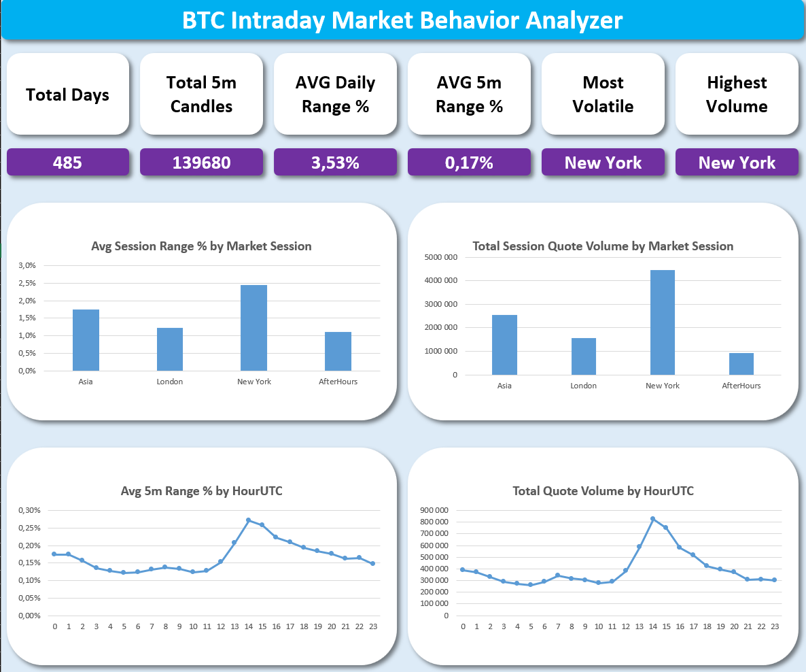
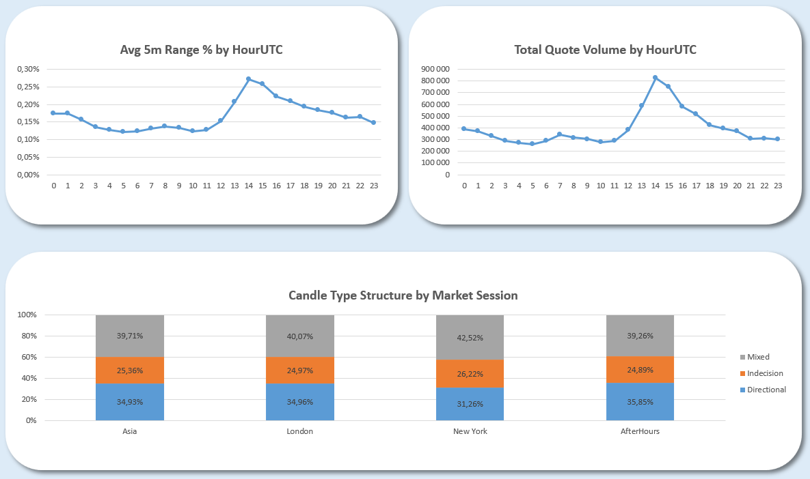

# BTC Intraday Market Behavior Analyzer

Excel VBA project analyzing BTC 5-minute intraday market behavior using Binance futures data.

The purpose is to demonstrate practical data analysis, Excel reporting, pivot table analysis, dashboard design and VBA automation skills.

## Project Overview

This project analyzes how BTC behaves during different parts of the trading day.
The dataset contains 5-minute market data from January 2025 to April 2026, with approximately 139,680 intraday candles and around 485 trading days.

The analysis focuses on volatility, volume, market sessions, candle structure, hourly activity and taker buy activity. The final result is an automated Excel dashboard generated with VBA.

## Dataset

The project uses Binance futures data for `BTCUSD_PERP` on a 5-minute timeframe.

The dataset includes price data, volume, trade count and taker buy activity fields. Based on these raw fields, additional analytical columns were created to measure candle range, candle body, close position, taker buy share and session behavior.

The analysis is based on relative market behavior across sessions and hours, not on building buy/sell signals.

## Workbook Structure

The workbook is organized into separate sheets for raw data, transformed data, pivot analysis and the final dashboard.

`BtcData` contains the cleaned 5-minute dataset with calculated candle-level metrics.
`DailyData` aggregates the intraday data into daily market behavior metrics.
`DailyAverages` and `DailyPivot` are used for daily-level summaries, buckets and pivot charts.
`SessionData` aggregates the market into four UTC-based sessions: Asia, London, New York and AfterHours.
`PivotSessions` contains the pivot tables and charts used in the final dashboard.
`Dashboard` is the final reporting layer generated automatically with VBA.

## Methodology

The analysis was built in several steps.

First, the raw 5-minute data was cleaned and extended with calculated fields such as candle range, candle body, range percentage, close position and taker buy share. Division-by-zero handling was added to avoid errors in pivot tables.

Next, the data was aggregated into daily metrics to understand how daily volatility, volume and close position behave together. This allowed the project to compare high-range, normal-range and low-range days.

Then, the same intraday dataset was grouped into market sessions. Each session represents one date and one market period. For each session, open, high, low, close, range, volume, trade count and taker buy share were calculated.

Finally, pivot tables and charts were created from the daily and session-level data. The dashboard was then automated with VBA, so the report layout, KPI cards and chart cards can be recreated from the macro.

## Market Sessions

The session split is based on UTC time:

| Session    | UTC Hours   |
| ---------- | ----------- |
| Asia       | 00:00-07:59 |
| London     | 08:00-12:59 |
| New York   | 13:00-20:59 |
| AfterHours | 21:00-23:59 |

This split allows the project to compare volatility and activity across different parts of the global trading day.

## Dashboard

The dashboard is generated automatically using VBA.

It includes KPI cards, session volatility charts, session volume charts, hourly volatility charts, hourly volume charts and candle structure analysis by market session.

Main dashboard KPIs include total analyzed days, total 5-minute candles, average daily range, average 5-minute range, most volatile session and highest volume session.

## Dashboard Screenshots





## VBA Automation

The main macro used in the project is `CreateDashboardLayout`.

The macro creates or clears the dashboard sheet, removes old shapes, applies the background design, creates the title card, builds KPI cards, calculates KPI values with Excel formulas, copies charts from the pivot sheet and embeds them into styled dashboard cards.

The VBA code was refactored into helper procedures to avoid repeating the same formatting logic multiple times.

Main procedures:

```text
CreateDashboardLayout
AddTitleCard
AddKPILabelCard
AddKPIValueCard
AddChartCard
```

The VBA module is available in:

```text
vba/modDashboard.bas
```

## Key Findings

The analysis showed that BTC intraday activity was not evenly distributed across the day. The New York session was the strongest session in terms of both average session range and total session volume. This suggests that the most active part of the BTC trading day, during the analyzed period, was concentrated around US trading hours.

Hourly analysis confirmed this pattern. The highest volatility and volume appeared around 14-15 UTC, which was the most active part of the day in the dataset. This period stood out both in terms of average 5-minute range and total quote volume.

Daily analysis showed that high-range days were usually supported by at least normal or high volume. In the analyzed dataset, high-range days did not appear together with low volume. This suggests that larger daily moves were connected with stronger market participation.

Most days were not extreme. Normal range and normal volume conditions dominated the dataset, which shows that high-volatility days were only a subset of the full period rather than the default market state.

Another important finding was that large daily range did not automatically mean a clean directional day. Some high-range days closed near the middle of the daily range, meaning that strong volatility often included two-sided movement instead of a simple trend from open to close.

Taker Buy Share stayed close to balanced levels across sessions and hours. This means that the dataset did not show a strong and persistent aggressive buy-side dominance during the analyzed period.

The New York session had the highest volatility and volume, but it did not have the highest share of directional candles. This distinction is important because higher activity does not always mean cleaner candle structure.

## Tools Used

* Microsoft Excel
* VBA
* Excel Tables
* Pivot Tables
* Pivot Charts
* Binance futures data

## Repository Structure

```text
BTC-intraday-market-behavior-analysis/
│
├── README.md
├── BTC_Intraday_Market_Behavior_Analyzer.xlsm
│
├── screenshots/
│   ├── dashboard_overview_top.png
│   └── dashboard_overview_bottom.png
│
└── vba/
    └── modDashboard.bas
```

## Main File

```text
BTC_Intraday_Market_Behavior_Analyzer.xlsm
```
